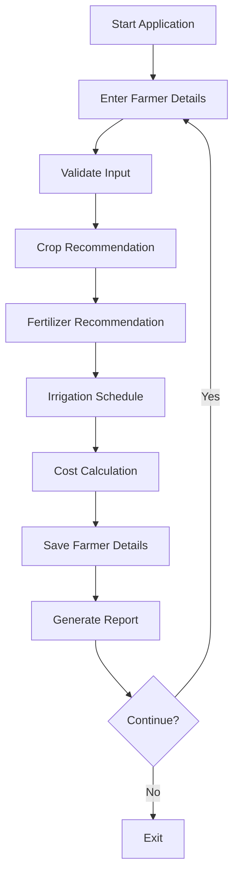

## Workflow Diagram

```mermaid
flowchart TD
    A[Start Application] --> B[Enter Farmer Details]
    B --> C[Validate Input]
    C --> D[Crop Recommendation]
    D --> E[Fertilizer Recommendation]
    E --> F[Irrigation Schedule]
    F --> G[Cost Calculation]
    G --> H[Save Farmer Details]
    H --> I[Generate Report]
    I --> J{Continue?}
    J -->|Yes| B
    J -->|No| K[Exit]
```